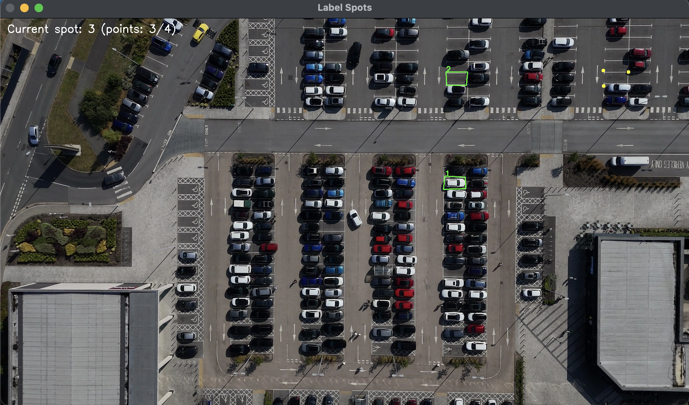
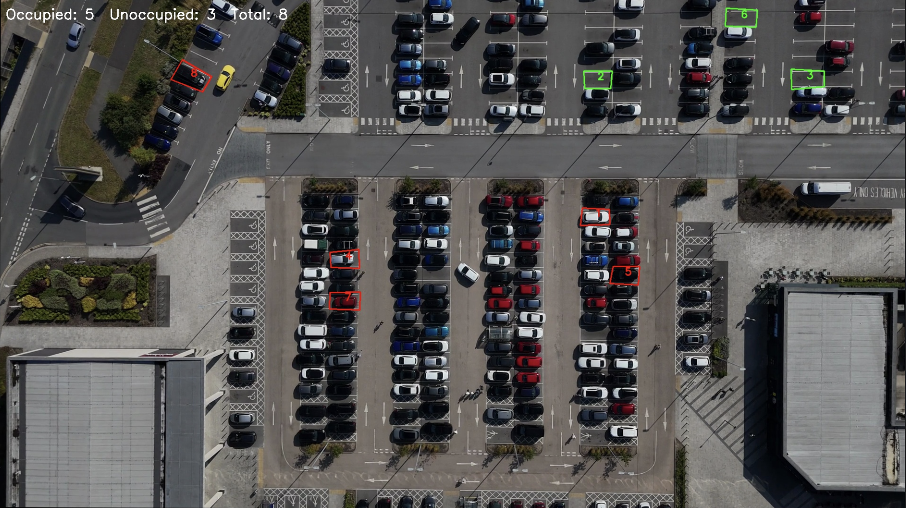
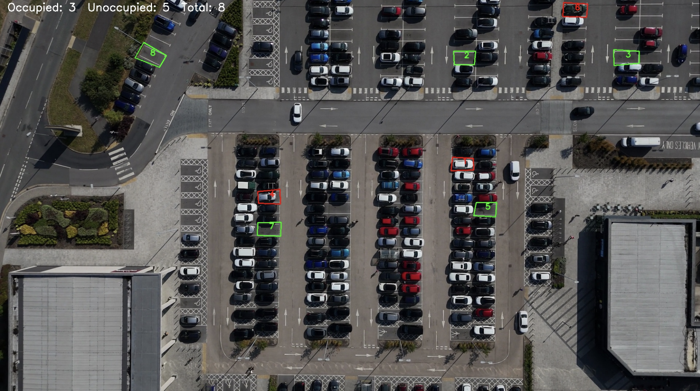
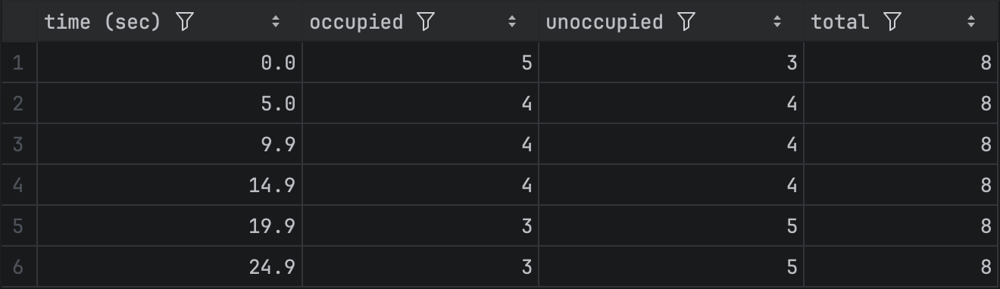

# Parking Space Occupancy Detection
### Computer Vision Project

This project implements a computer vision pipeline that detects parking space occupancy from parking lot video footage.

The system extracts frames from a parking lot video, allows users to label individual parking spaces, trains a ResNet-18 convolutional neural network classifier on the labeled occupied and unoccupied parking spot images, and applies the trained model to analyze parking occupancy across video timestamps. 

Features

- Custom dataset generated from parking lot video frames with manually labeled parking spaces
- Interactive parking space annotation tool using OpenCV
- Binary image classifier (occupied vs. unoccupied) trained using a ResNet-18 architecture
- Image augmentation (cropping, flipping, rotation, color jitter) applied during training to improve model generalization
- Model evaluation using accuracy, balanced accuracy, recall, and confusion matrix
- Video snapshot inference pipeline for detecting parking occupancy over time

## Example Demonstration

### Parking Space Labeling

The system includes an interactive OpenCV tool that allows users to label parking space regions from a reference frame.

### Snapshot-Based Occupancy Detection

The trained model analyzes parking spaces from video snapshots and predicts whether each space is occupied or free.

Initial snapshot (t = 0 seconds):

Later snapshot (t = 25 seconds):

### Occupancy Over Time

Parking occupancy statistics are recorded over time and saved to a CSV file for analysis.

## Project Structure

extract_frame.py  
Extracts a reference frame from the parking lot video.

label_spots.py  
Interactive OpenCV tool that allows users to manually label parking space locations.

train_occupancy_classifier.py  
Trains the ResNet-18 model on the labeled dataset images.

final_test.py  
Evaluates model performance on the test dataset images.

snapshot_occupancy.py  
Runs the trained model on video snapshots to detect parking occupancy.

dataset/  
Contains train / validation / test image datasets.

data/  
Parking lot video and extracted reference frame.

occupancy_classifier.pt  
Saved model weights after training.

spots_video.json  
Contains the coordinates of labeled parking spaces.

test_predictions.csv  
Prediction results generated during testing.

## Model Performance

Evaluation metrics from the test dataset:

Accuracy: 97.5%  
Balanced Accuracy: 97.5%  
Recall (occupied): 100%  
Recall (unoccupied): 95%

Balanced accuracy is reported to account for potential class imbalance between occupied and unoccupied spaces.

## Frameworks Used

- Python
- PyTorch
- OpenCV
- NumPy
- Torchvision

## Author

Shaurya Shrivastava
